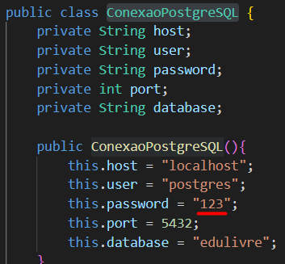

# EduLivre 📚

Sistema acadêmico com funcionalidades básicas de gestão de usuários, cursos, matrículas e conteúdos, utilizando **Java + PostgreSQL + JDBC**.

---

## 🧩 Tecnologias Utilizadas

- **Java 17**
- **PostgreSQL** com extensão `uuid-ossp`
- **JDBC** (`postgresql-42.7.7.jar`)
- **Maven**
- Execução via **terminal (psql)** e **VS Code**

---

## 🔧 Como Executar o Projeto

### 1. Clonar o projeto

```bash
git clone https://github.com/seuusuario/edulivre.git
cd edulivre
```

---

### 2. Criar e popular o banco de dados

Abra o **terminal (cmd)** e digite:

```bash
psql -h localhost -U postgres
```

Digite a senha quando solicitado, e depois execute:

(Se preciso, altere a senha dentro de negocio/ConexaoPostgreSQL)


```sql
\i caminho/para/edulivre.sql
```

---

### 3. Compilar e executar no VS Code

No terminal do **VS Code** (dentro da pasta do projeto):

```bash
mvn compile
mvn exec:java
```

Ou, se preferir, clique com o botão direito no arquivo `Main.java` e selecione **"Run Java"** (requer extensão do Java instalada).

---

## ✅ Funcionalidades Implementadas

- [x] Inserção de avaliações em JSONB
- [x] Consulta de cursos com média de avaliação e total de alunos
- [x] Busca de conteúdos por curso
- [x] Busca de usuário por e-mail
- [x] Matrícula de usuários com validação
- [x] Adição de comentários no JSONB de avaliação
- [x] Arquitetura em camadas: apresentação, negócio e persistência

---

## 📂 Estrutura do Projeto

```plaintext
src/
├── apresentacao/         # Classe Main.java
├── negocio/              # Classes de domínio (Usuario, Curso, Comentario, etc.)
└── persistencia/         # DAOs e ConexaoPostgreSQL
```

---

## 📦 Dependências (Maven)

Adicionadas ao `pom.xml`:

```xml
<dependency>
    <groupId>org.postgresql</groupId>
    <artifactId>postgresql</artifactId>
    <version>42.7.7</version>
</dependency>
```

---


